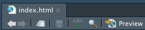

# `TeamTimpson` website

The `TeamTimpson` website is hosted on GitHub. In order to make changes you need to edit the `html` file. You will most likely want to edit two things on the site:

* Your profile
* Selected publications

## To edit follow these steps:

### 1. Clone the Git repository 

  a. Change directory in your computer to somehwere you want to put the `TeamTimpson` repo, for example the desktop: 
```
cd Users/myName/Desktop
```
  b. Use git to clone the `TeamTimpson.github.io` repository to this location:
```
git clone https://github.com/TeamTimpson/TeamTimpson.github.io.git
```
  c. If you don't already have git installed <b>b</b> wont work and you'll be prompted to install - follow the instructions
  
### 2.  Edit the `html` file
  a. The repository will have an `R` project called `TeamTimpson.github.io.Rproj`. Open this and `R Studio` will load
  
  b. Open the `index.html` file in your now open `R Studio` session
  
   * Once open you can click the `preview` button at the top left or press <kbd>cmd</kbd> + <kbd>shift</kbd> + <kbd>K</kbd> on mac or <kbd>Windows</kbd> + <kbd>shift</kbd> + <kbd>K</kbd> - this will show you the preview of the `html` file (it is good to preview after you make changes so you can see whether youve done what you wanted to do)
      
  
  c. To make/edit a profile:
      
   1. Go to the `Section: people` section of the `html` file
      
   2. Each profile is contained within an `<article>` `</article>` tag 
      
   3. Copy the entire `<article>` `</article>` tag of an already made profile and paste it below to add a new profile
      
   4. Each profile is made up of:
         * an image
         
         * name
         
         * position
         
         * description
         
         * external links
      
   5. To change the image:
         
      1. You first need to uplaod an image into the `images/` directory in the format `your_name` - the image can be any form of `png` or `jpg`
         
      2. Change the `src="images/profile/Nic_Timpson.jpeg"` in the `` `</img>` tag to your images name
         
      3. Change the `href=""` in the `` `</img>` tag to your website on the University of Bristol
         
      4. Change the name and position in the heading tag `<h3>` `</h3>` and 
         
      5. Add text to describe what you do inside of the paragraph tag `<p>` `</p>`
         
      6. Add your Twitter and email in the `href=""` of the last part of the profile `<ul class="icons">`
            
        * We can add additional links here if people want e.g. GitHub, Google Scholar, Orcid...
  
  d. to add/edit a publication
      
   1. Go to the `Section: selected publications` section of the `html` file
      
   2. Each publication is contained within an `<article>` `</article>` tag
      
   3. Copy the entire `<article>` `</article>` tag of an already made publication and paste it below to add a new publication
      
   4. Each publication is made up of a single image that links to the publication
      
   5. To change the image and link:
          
      1. Upload an image of the publication - I usually screenshot the top header part of the manuscript - and save it as `Author_keyword`. T image can be any form of `png` or `jpg`
          
      2. Change the `src="images/papers/Lawson_structure.jpg"` in the `` `</img>` tag to your images name
          
      3. Change the `href=""` in the `` `</img>` tag to the website of the publication
      

## Helpful HTML commands
`HTML` is very similar to `markdown` and `Rmarkdown`. `HTML` is written using tags. These follow the premise of an open and a close. You open the tag, for example to make words strong you use the tag `<strong>`. You would open the command with `<strong>` and then you would close the tag using a `/` - `</strong>`. You can see this in action `<strong>`<strong>here</strong>`</strong>`. `<strong>`<strong>If you forget to close the tag everything after the open tag will have the tag applied</strong>. The following are some useful tags and example uses.

* strong = `<strong>`my words`</strong>`
* italic = `<i>`<i>my words</i>`</i>`
* bold = `<b>`<b>my words</b>`</b>`

You can combine tags as well - `<b><i>`<b><i>my words</i></b>`</i></b>`

* link = `<a href="www.google.co.uk">`<a href="www.google.co.uk">google</a>`</a>`
* image = ``</img>`</img>`"
* new line = `<br>`


* heading 1 = `<h1>`<h1>my words</h1>`</h1>`
* you can have lots of subheadings e.g. heading 5 `<h5>`<h5>my words</h5>`</h5>`


